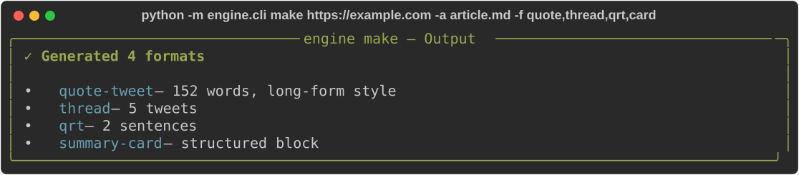

# Social Content Engine

[](LICENSE)
[](https://www.python.org/downloads/)

CLI tool that takes a source (YouTube video, article URL, pasted text) and your article, then generates multiple social media formats via the Anthropic API: quote-tweets, threads, QRTs, and summary cards.



## Features

- **Quote-tweet** — hook-driven X posts linking source to your article, with two styles (long-form operator / short positive)
- **Thread** — 5-10 tweet breakdown of the source with article bridge
- **QRT** — sharp 1-3 sentence commentary for quote retweets
- **Summary card** — structured text block for Telegram/LinkedIn/newsletters
- **Source extraction** — auto-fetches content from YouTube URLs, web articles, or local files
- **Anti-duplication** — pass prior quotes to avoid reusing structures in a series

## Setup

```bash
pip install -e .
cp .env.example .env
# Add your ANTHROPIC_API_KEY to .env
```

## Usage

```bash
# Generate a quote-tweet from a YouTube video
python -m engine.cli make "https://youtube.com/watch?v=..." --article article.md --formats quote

# Generate multiple formats
python -m engine.cli make "https://example.com/post" -a article.md -f quote,thread,qrt,card

# Short style quote-tweet
python -m engine.cli make "https://youtube.com/watch?v=..." -a article.md -f quote -s short

# Dry run (show prompts without API call)
python -m engine.cli make "https://example.com" -a article.md --dry-run

# Save output to files
python -m engine.cli make "https://example.com" -a article.md -o output/

# List available formats
python -m engine.cli formats
```

## Quote-Tweet Rules (from SKILL)

The quote-tweet format follows a production-tested skill with strict rules:

- **Hook formula:** `[Name/role] [recency verb] [specific action]` — must fit on ONE line
- **Verbatim quotes:** only real quotes from source or article — never invented
- **Numbers:** only attributable — never made up for credibility
- **Anti-duplication:** no word-for-word reuse across series
- **Two styles:** Long-form (Karpathy/Boris, 150-260 words) or Short (Movez, 40-80 words)

## Architecture

```
src/engine/
├── cli.py              # Typer CLI with make and formats commands
├── client.py           # Anthropic API wrapper (key from .env)
├── sources.py          # Source content extraction (URL/YouTube/file)
└── formats/
    ├── quote_tweet.py  # Quote-tweet prompt logic (from SKILL)
    ├── thread.py       # Thread format (5-10 tweets)
    ├── qrt.py          # QRT format (1-3 sentences)
    └── summary_card.py # Summary card format
```

## Requirements

- Python 3.11+
- Anthropic API key
- `anthropic`, `typer`, `rich`, `httpx`

## License

MIT
